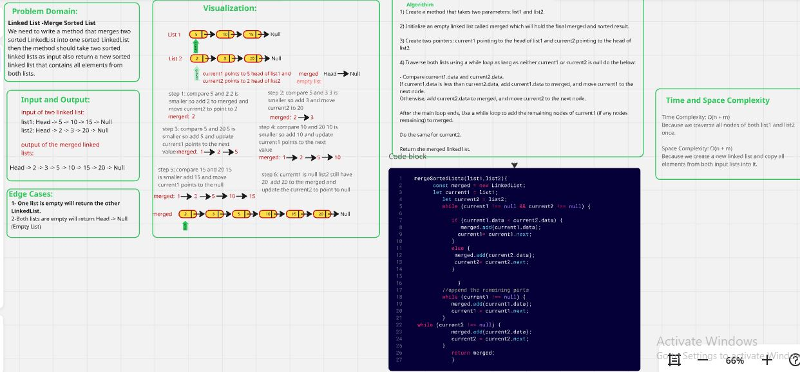
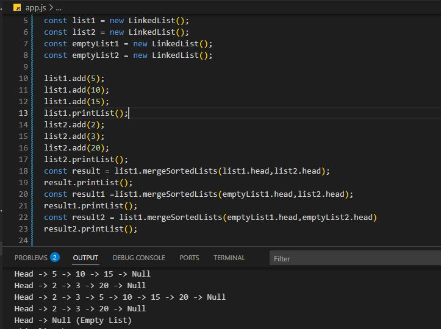
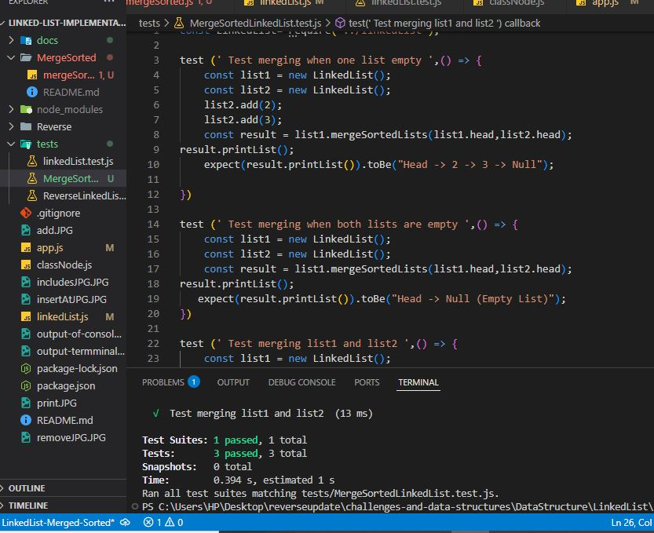

## Data Structure-LinkedList Merge Two Sorted Singly Linked Lists 

### Implements a method to merge two sorted singly linked lists into a new sorted linked list. 
### t takes the first nodes of the two input lists and returns a new list that has all the values from both, still in order from smallest to largest. It also works if one or both lists are empty

## Capture of the whiteBoared

## Capture of the console-log Output

## Capture of the test terminal  

     
