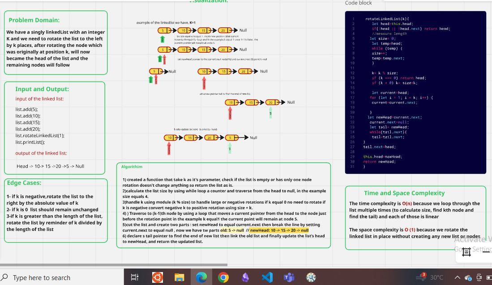
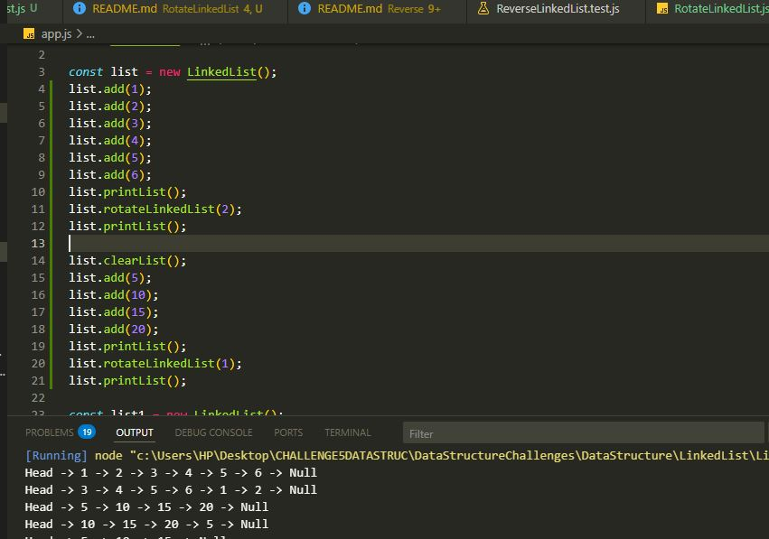
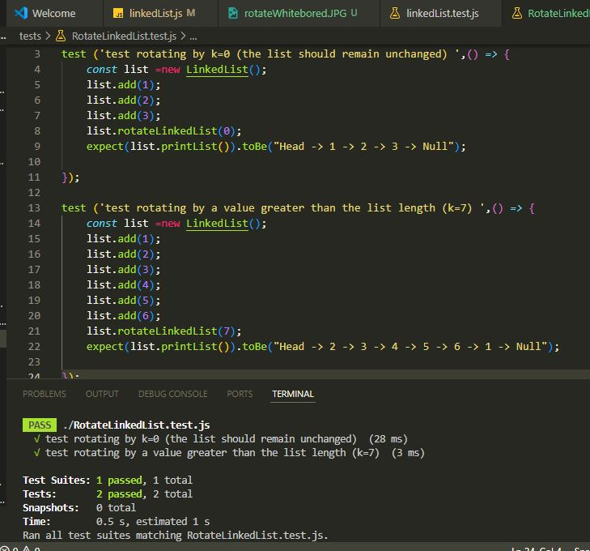

# Rotate LinkedList by K

## Given a singly linked list and an integer k, rotate the list to the left by k positions. The rotation is done in-place by rearranging node connections without creating a new list.

## Capture of the whiteBoared

## Capture of the console-log Output

## Capture of the test terminal 

   