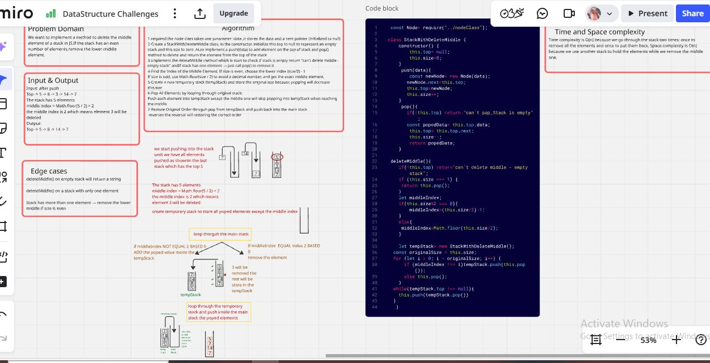
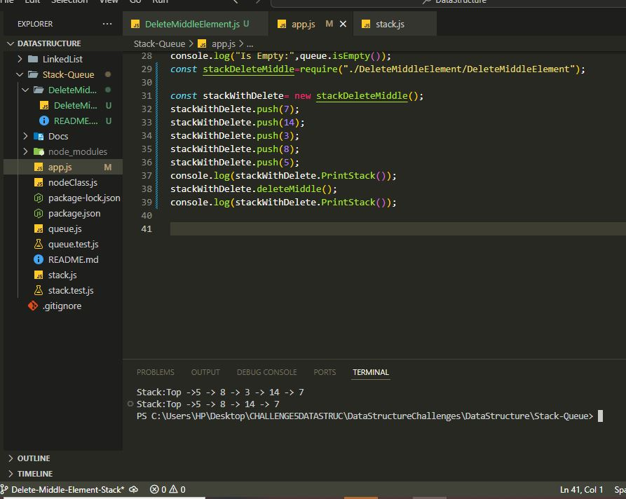
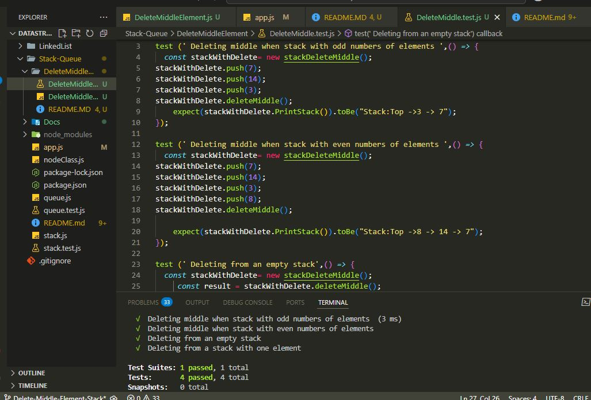

# Delete Middle Element of a Stack

## Implement a custom stack with a deleteMiddle method that removes the middle element from the stack. It uses a temporary stack to hold all elements except the middle one, then restores the original order by pushing them back. It follows LIFO (Last In First Out) behavior and supports basic push, pop, and print operations.

## Whiteboared Image

## consloe log Image

## test cases terminal image

