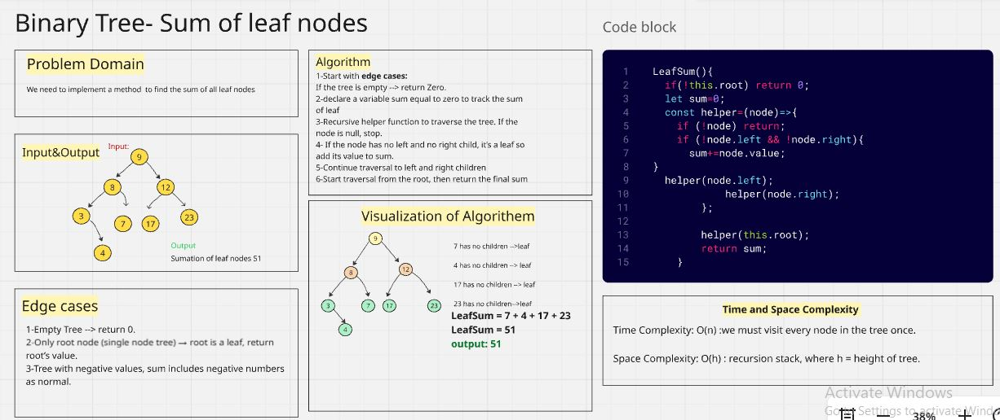
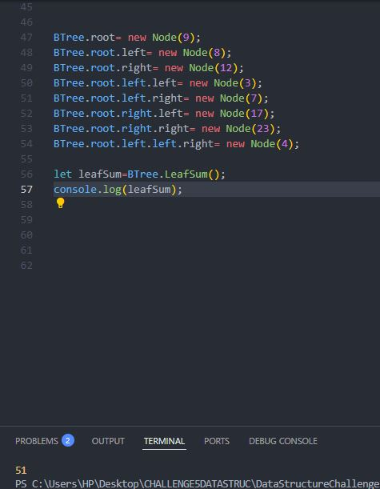
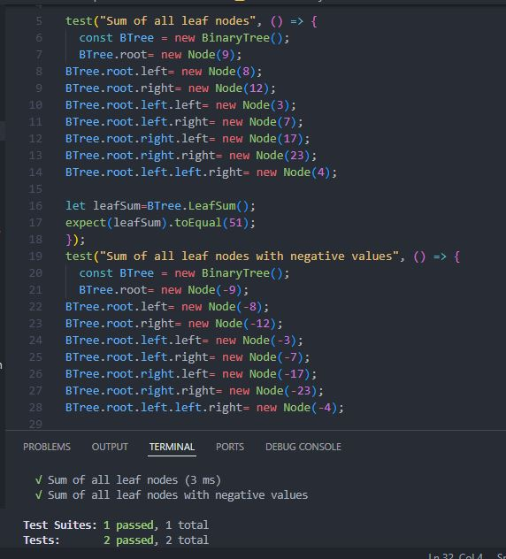

# Sum of Leaf Nodes in a Binary Tree

## We implement a method called LeafSum to calculate the sum of all leaf nodes in a Binary Tree (BT). A leaf node is a node that does not have any children (both left and right are null).

## Whiteboard challenge solution

## consolelog capture

## Test terminal capture
