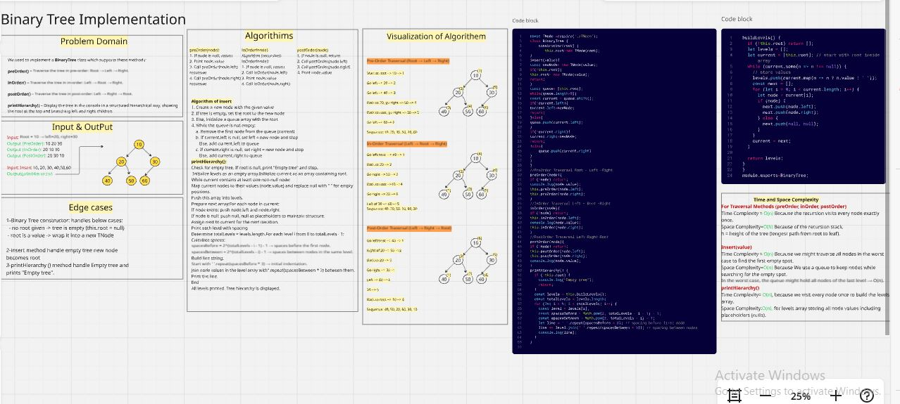
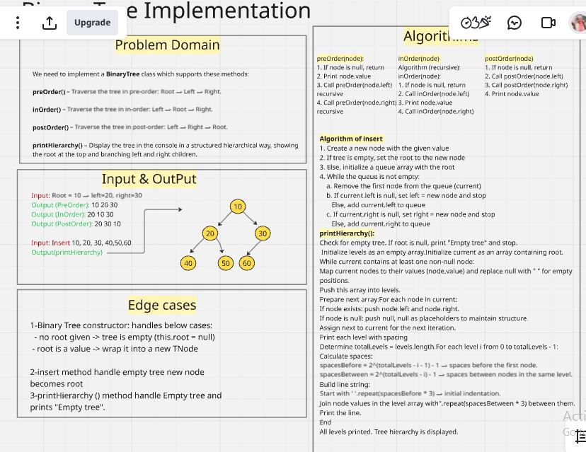
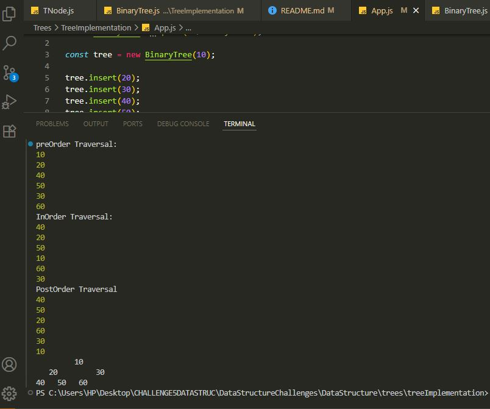
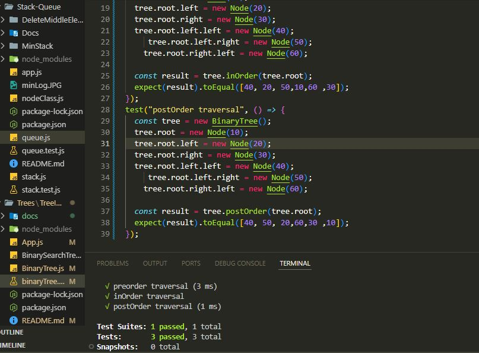

# Binary Tree and Binary Search Tree Implementation

## Binary Tree:

### A data structure consisting of nodes, where each node has at most two children: left and right.

### Each node contains a value and references to left and right child nodes.

### Binary Tree does not enforce order — values can be anywhere.

### Methods we implement:

- insert(value) — Add a new node to the tree. For a generic Binary Tree, we can insert level-wise (filling left to right).

- preOrder(node) — Traverse: Root → Left → Right

- inOrder(node) — Traverse: Left → Root → Right

- postOrder(node) — Traverse: Left → Right → Root

- printHierarchy() — Display the tree in the console in a structured way

## Whiteboard challenge solution

## consolelog capture

## Test terminal capture
