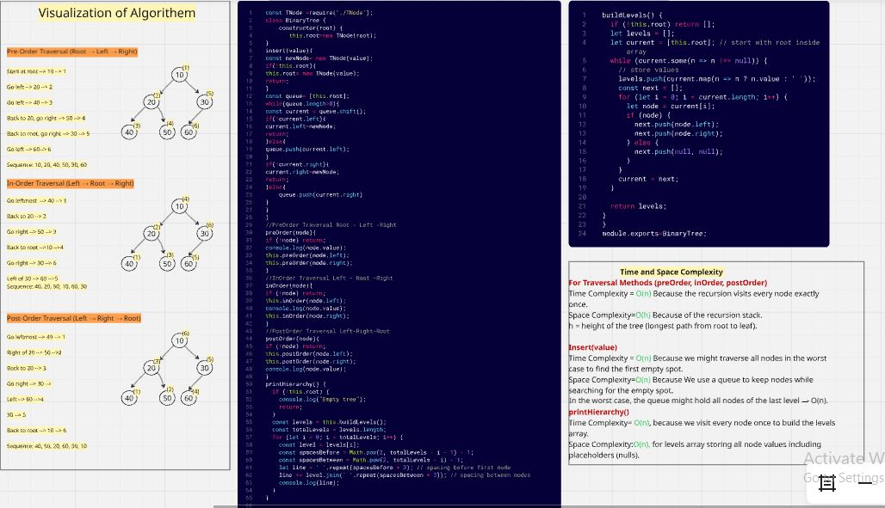

# Binary Tree and Binary Search Tree Implementation

## Binary Tree:

### A data structure consisting of nodes, where each node has at most two children: left and right.

### Each node contains a value and references to left and right child nodes.

### Binary Tree does not enforce order — values can be anywhere.

### Methods we implement:

- insert(value) — Add a new node to the tree. For a generic Binary Tree, we can insert level-wise (filling left to right).

- preOrder(node) — Traverse: Root → Left → Right

- inOrder(node) — Traverse: Left → Root → Right

- postOrder(node) — Traverse: Left → Right → Root

- printHierarchy() — Display the tree in the console in a structured way

## Whiteboard challenge solution

## consolelog capture

## Test terminal capture

## Binary Search Tree:

### It's a type of Binary Tree where All values in the left subtree are smaller than the node’s value and All values in the right subtree are greater than the node’s value.

### In this assignment, I implemented a Binary Search Tree class with methods to:

- Add new values into the tree.

- Check if a value exists in the tree.

- Remove a node with the specific value while maintaining the BST proprties

## Whiteboard challenge solution

## consolelog capture

## Test terminal capture
