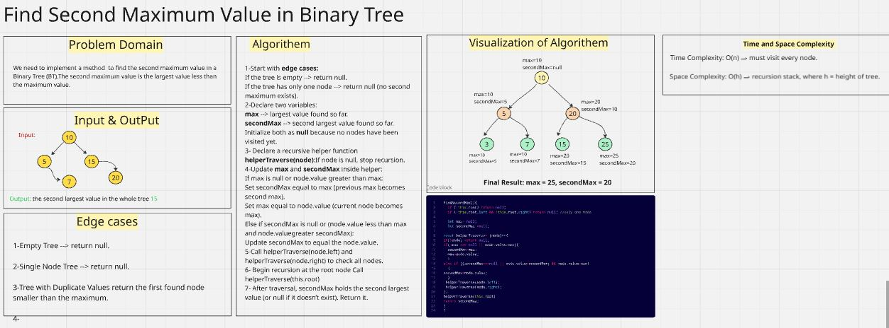
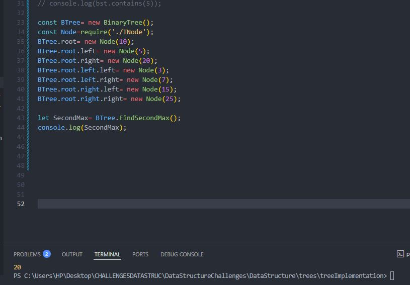
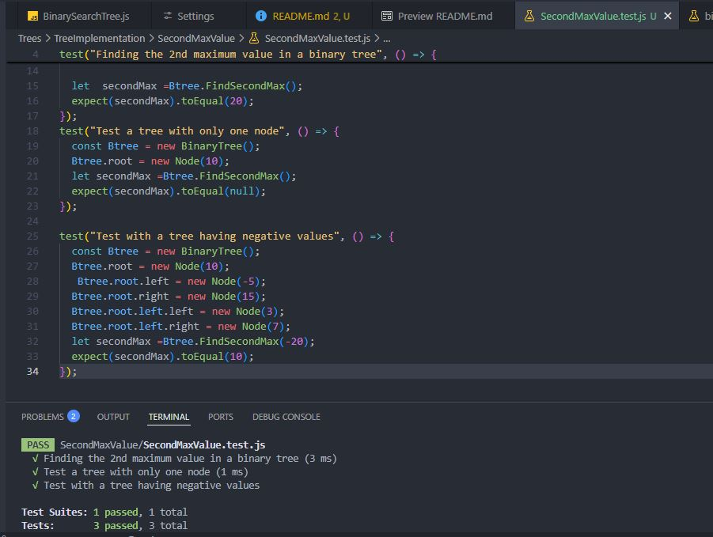

# Find Second Maximum in a Binary Tree

## We implement a method to find the second maximum value in a Binary Tree (BT).The second maximum is defined as the largest value in the tree that is smaller than the maximum value.

Whiteboard challenge solution:

Console Output:

Test Terminal Output:

